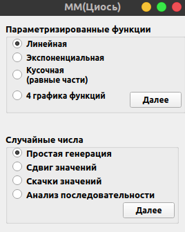
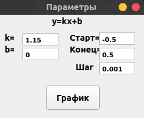
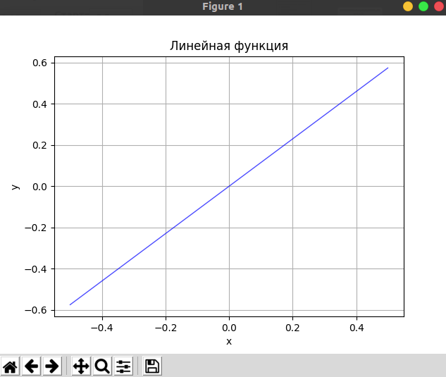
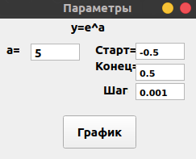
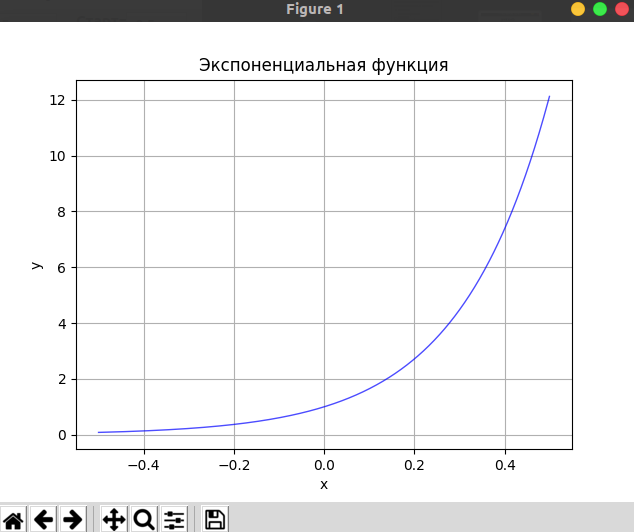
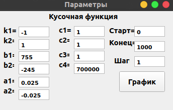
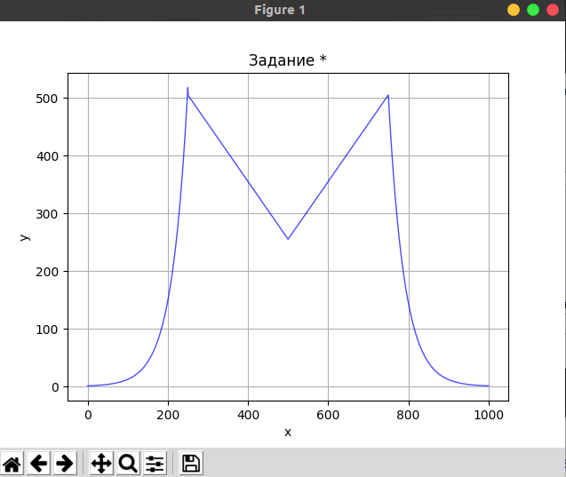
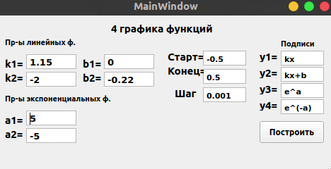
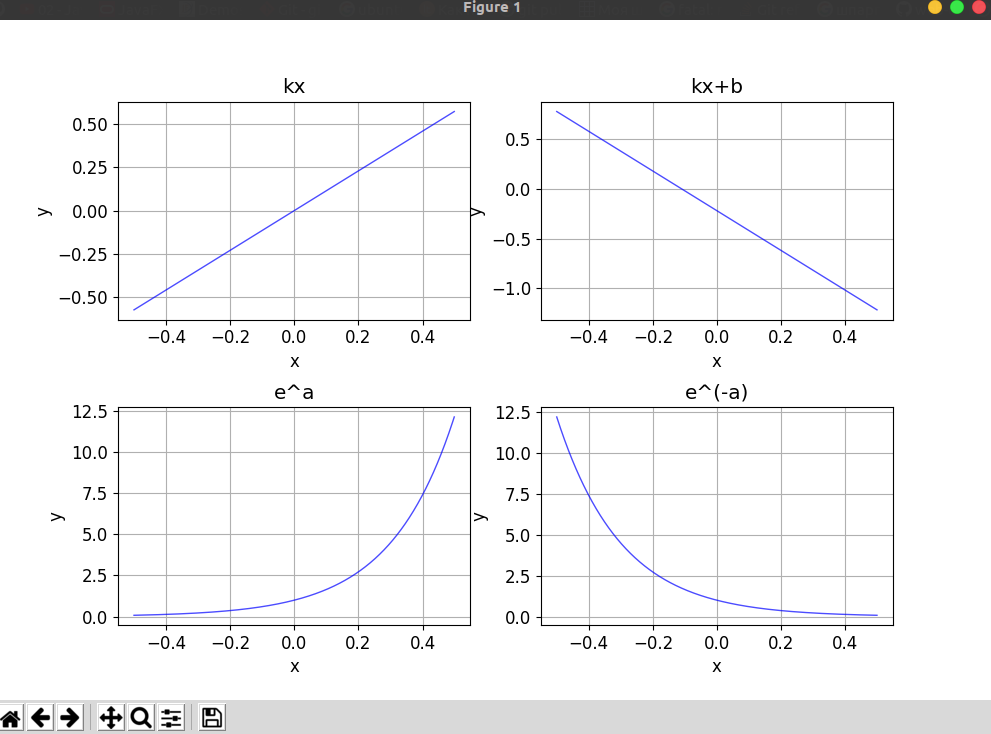

# MathMethods
#### Простой графический интерфейс на PyQT5
#### !!! Шрифт оптимизирован только для Windows NT
## Анализ процессов
### 1. Общий вид

### 2. График линейной функции

### 3. График экспоненциальной функции

### 4. График кусочной функции

### 5. Графики элементарных функций

### 6. Генерация случайных чисел
### 7. Сдвиг значений функции
### 8. Создание скачков значений (шум)
### 9. Общий анализ последовательности
